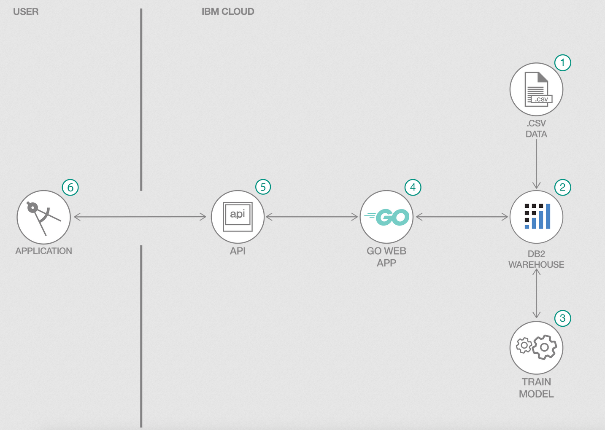

# Predict Home Value Using GO language and DB2 AI

This is an AI appplication written in `golang` which uses IBM Db2 Warehouse on cloud built-in stored procedures to train and run models on data residing in IBM Db2 Warehouse on Cloud. This specific application runs the built-in linear regression stored procedure to predict the home sales price based on provided property details.

IBM Db2 Warehouse on cloud has built-in stored procedures that helps you analyze data. Operations and computations are performed by the IBM Db2 Warehouse engine itself without having to move the data. This way you can achieve greater performance in terms of computations and retrieval of the  results. You can read more about the different algortithm that IBM Db2 Warehouse on cloud supports in the form of stored procedures [here](https://docs-iias.mybluemix.net/docs/content/SS6NHC/com.ibm.swg.im.dashdb.analytics.doc/doc/r_analytic_stored_procedures.html).

## Flow



1. Load training data to IBM Db2 Warehouse.
2. IBM Db2 Warehouse stores training and test data in a table.
3. Train the model by running the built-in stored procedure in IBM Db2 warehouse.
4. An application written in golang to predict home sale price.
5. The prediction logic is exposed through an API.
6. Frontend application calls the API to get the prediction results.

## Steps

1. [Clone the repo](#1-clone-the-repo)
1. [Create IBM Db2 Warehouse on Cloud](#2-create-ibm-db2-warehouse-on-cloud)
1. [Load and split the data](#3-load-and-split-the-data)
1. [Create the model](#4-create-the-model)
1. [Predict using linear regression](#5-predict-using-linear-regression)
1. [Add Db2 credentials to .env file](#6-add-db2-credentials-to-env-file)
1. [Install DB2 Driver in your system](#7-install-db2-driver-in-your-system)
1. [Run the application](#8-run-the-application)

### 1. Clone the repo

```bash
git clone https://github.com/IBM/predict-home-value-using-go-and-db2-ai
```

### 2. Create IBM Db2 Warehouse on Cloud

Create the Db2 Warehouse on Cloud service and make sure to note the credentials using the following link:

* [**IBM Db2 Warehouse on Cloud**](https://cloud.ibm.com/catalog/services/db2-warehouse)

### 3. Load and split the data

In the Db2 warehouse resource page, click on `Manage` and go to DB2 console by clicking the button `Open Console`. In the console do the following to load your data.

* Click `Load` from the hamburger menu.
* Click `Browse files` or you can drag files, select the [data/train.csv](data/train.csv) and click `Next`
* Choose existing schema or create a new one by clicking `+ New Schema`
* Create a new table by clicking `+ New Table` on the schema you created and click `Next`
* Make sure the column names and data types displayed are correct, then cick `Next`
* Click `Begin Load` to load the data

Once the data is loaded you can split the data into two tables, one that is used for creating the model and the other to test the model. The data in test table will be used to predict one of its columns. In order to split the data, we can use one of the built-in stored procedures. Before you run the split stored procedure, lets enrich the original data by creating a view out of the original table. This makes the query to create model and prediction run faster.

In the IBM Db2 console, click `Run SQL` from the hamburger menu and run the following sql statement to create the view.

``` sql
CREATE VIEW DB2WML.HOME_SALES_VIEW (
    ID,LOTAREA,BLDGTYPE,HOUSESTYLE,OVERALLCOND,YEARBUILT,ROOFSTYLE,EXTERCOND,FOUNDATION,BSMTCOND,HEATING,HEATINGQC,CENTRALAIR,ELECTRICAL,FULLBATH,HALFBATH,BEDROOMABVGR,KITCHENABVGR,KITCHENQUAL,TOTRMSABVGRD,FIREPLACES,FIREPLACEQU,GARAGETYPE,GARAGEFINISH,GARAGECARS,GARAGECOND,POOLAREA,POOLQC,FENCE,MOSOLD,YRSOLD,SALEPRICE
  )
AS
   SELECT ID, LOTAREA, BLDGTYPE, HOUSESTYLE, OVERALLCOND, YEARBUILT, ROOFSTYLE, EXTERCOND, FOUNDATION, BSMTCOND, HEATING, HEATINGQC, CENTRALAIR, ELECTRICAL, FULLBATH, HALFBATH, BEDROOMABVGR, KITCHENABVGR, KITCHENQUAL, TOTRMSABVGRD, FIREPLACES, FIREPLACEQU, GARAGETYPE, GARAGEFINISH, GARAGECARS, GARAGECOND, POOLAREA, POOLQC, FENCE, MOSOLD, YRSOLD, SALEPRICE
  FROM DB2WML.HOME_SALES;

```

Once the above statement runs successfully, run the following stored procedure from the sql editor.

```sql
CALL IDAX.SPLIT_DATA('intable=DB2WML.HOME_SALES_VIEW,
traintable=DB2WML.HOME_SALES_TRAIN,
testtable=DB2WML.HOME_SALES_PREDICT,
id=ID,
fraction=0.95');
```

The training and test data will be stored in the HOME_SALES_TRAIN and HOME_SALES_PREDICT tables respectively, and this function will use the ID column to randomly split the data for each.

You can find details about the split stored procedure [here](https://www.ibm.com/support/knowledgecenter/en/SS6NHC/com.ibm.swg.im.dashdb.analytics.doc/doc/r_data_transform_split_data_procedure.html)


### 4. Create the model

Now we are ready to train and create the model using the traing data in `DB2WML.HOME_SALES_TRAIN`. In the sql editor run the follwing script to create the model.

```sql
CALL IDAX.LINEAR_REGRESSION
('model=DB2WML.HOME_SALES_MODEL,
intable=DB2WML.HOME_SALES_TRAIN,
id=ID,
target=SALEPRICE,
incolumn=LOTAREA;BLDGTYPE;HOUSESTYLE;OVERALLCOND;YEARBUILT;ROOFSTYLE;EXTERCOND;FOUNDATION;BSMTCOND;HEATING;HEATINGQC;CENTRALAIR;ELECTRICAL;FULLBATH;HALFBATH;BEDROOMABVGR;KITCHENABVGR;KITCHENQUAL;TOTRMSABVGRD;FIREPLACES;FIREPLACEQU;GARAGETYPE;GARAGEFINISH;GARAGECARS;GARAGECOND;POOLAREA;POOLQC;FENCE;MOSOLD;YRSOLD,
coldefrole=ignore, calculatediagnostics=false');

```

You can find details about the linear regression stored procedure [here](https://www.ibm.com/support/knowledgecenter/en/SS6NHC/com.ibm.swg.im.dashdb.analytics.doc/doc/r_linear_regression_build_model_procedure.html)

### 5. Predict using linear regression

Once the model is created successfully, we can start predict the home sales price for new input paramters against the model created. Run the following script in the sql editor. The insert statement inserts new 5 record into the test table which will be used for predicting the sales price of that home.

```sql

insert into DB2WML.HOME_SALES_PREDICT
with max(max_id) as (select max(id) from DB2WML.HOME_SALES_VIEW)
SELECT ID + max_id as ID, LOTAREA, BLDGTYPE, HOUSESTYLE, OVERALLCOND, YEARBUILT, ROOFSTYLE, EXTERCOND, FOUNDATION, BSMTCOND, HEATING, HEATINGQC, CENTRALAIR, ELECTRICAL, FULLBATH, HALFBATH, BEDROOMABVGR, KITCHENABVGR, KITCHENQUAL, TOTRMSABVGRD, FIREPLACES, FIREPLACEQU, GARAGETYPE, GARAGEFINISH, GARAGECARS, GARAGECOND, POOLAREA, POOLQC, FENCE, MOSOLD, YRSOLD, SALEPRICE
  FROM DB2WML.HOME_SALES_VIEW, max
limit 5;


CALL IDAX.PREDICT_LINEAR_REGRESSION
('model=DB2WML.HOME_SALES_MODEL,
intable=DB2WML.HOME_SALES_PREDICT,
outtable=DB2WML.HOME_SALES_RESULT,
id=ID');
```

You can find details about the predict linear regression stored procedure [here](https://www.ibm.com/support/knowledgecenter/en/SS6NHC/com.ibm.swg.im.dashdb.analytics.doc/doc/r_linear_regression_predict_procedure.html)

You can check the results of the prediction in the `outtable`. The following sql statment will print out the result.

```sql
SELECT IN.*, OUT.SALEPRICE AS SALEPRICE_PREDICT
FROM DB2WML.HOME_SALES_PREDICT AS IN, DB2WML.HOME_SALES_RESULT AS OUT
WHERE IN.ID=OUT.ID;
```

### 6. Add Db2 credentials to .env file

Copy the local `env.sample` file and rename it `.env`:

```bash
    cp env.sample .env
```

Update the `.env` file with the credentials from your Assistant service.

```bash
    # Copy this file to .env and replace the credentials with
    # your own before starting the app.

    DB2_HOST=<add host name>
    DB2_USER=<add user>
    DB2_PASS=<add password>
    DB2_PORT=<add port>
    DB2_DBNAME=<add dbname>
```

### 7. Install DB2 Driver in your system

To install go Db2 driver into your application, follow the following steps.

* From a terminal run: `go get -d github.com/ibmdb/go_ibm_db`
* Go to installation folder where go_ibm_db is downloaded in your system (Example: `/home/<uname>/go/src/github.com/ibmdb/go_ibm_db/installer`) and run `go run setup.go` where `<uname>` is the username of your system.
* `export DB2HOME=/home/<uname>/go/src/github.com/ibmdb/go_ibm_db/installer/clidriver`
* `export CGO_CFLAGS=-I$DB2HOME/include`
* `export CGO_LDFLAGS=-L$DB2HOME/lib`
* Linux:
    `export LD_LIBRARY_PATH=/home/<uname>/go/src/github.com/ibmdb/go_ibm_db/installer/clidriver/lib`
  Mac:
    `export DYLD_LIBRARY_PATH=$DYLD_LIBRARY_PATH:/home/<uname>/go/src/github.com/ibmdb/go_ibm_db/installer/clidriver/lib`

> Note: make sure you change the `<uname>` to username of your system.

### 8. Run the application

```bash
    go run server.go
```

To test the API you can run: `curl http://localhost:8080`

## Learn more

* **Artificial Intelligence Code Patterns**: Enjoyed this Code Pattern? Check out our other [AI Code Patterns](https://developer.ibm.com/technologies/artificial-intelligence/)

## License

This code pattern is licensed under the Apache License, Version 2. Separate third-party code objects invoked within this code pattern are licensed by their respective providers pursuant to their own separate licenses. Contributions are subject to the [Developer Certificate of Origin, Version 1.1](https://developercertificate.org/) and the [Apache License, Version 2](https://www.apache.org/licenses/LICENSE-2.0.txt).

[Apache License FAQ](https://www.apache.org/foundation/license-faq.html#WhatDoesItMEAN)
